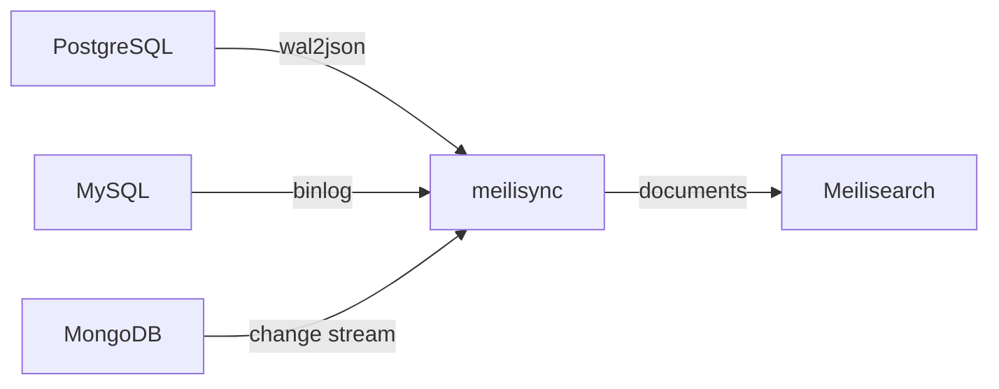

# Welcome

<div class="doc-hero" markdown="1">

# meilisync

Realtime change-data-capture from PostgreSQL, MySQL, and MongoDB into [Meilisearch](https://www.meilisearch.com/).

meilisync tails the source database, maps rows to documents, and keeps indexes up to date — including an optional full backfill on first start.

[Get started](getting-started.md){ .md-button .md-button--primary }
[Install](install.md){ .md-button }
[Astrum Agency](https://astrum.agency){ .md-button }

</div>

## What it does

<div class="doc-feature-grid" markdown="1">

<div class="doc-feature" markdown="1">

**Change data capture**

PostgreSQL logical replication (`wal2json`), MySQL binlog, and MongoDB change streams.

</div>

<div class="doc-feature" markdown="1">

**Meilisearch native**

Batched inserts, index swap refresh, and a count check against the source.

</div>

<div class="doc-feature" markdown="1">

**Stays connected**

PostgreSQL reconnects with exponential backoff and resumes from the last LSN.

</div>

<div class="doc-feature" markdown="1">

**Plugins**

Transform events before and after they are written to Meilisearch.

</div>

</div>

## How it works



<ol class="doc-steps" markdown="1">
<li>On start, each table with <code>full: true</code> is copied into Meilisearch if the index does not exist yet.</li>
<li>Incremental events are applied as they arrive (create / update / delete).</li>
<li>Progress (LSN, binlog file/position, or resume token) is stored in a file or Redis so a restart continues where it left off.</li>
</ol>

## Why this fork

This is a maintained fork of [long2ice/meilisync](https://github.com/long2ice/meilisync), maintained by [Astrum Agency](https://astrum.agency), focused on production PostgreSQL:

- **wal2json format version 2** — one JSON object per change, so large transactions no longer hit PostgreSQL's ~1 GB string-buffer limit
- **Table-filtered decoding** via `add-tables`
- **Automatic reconnect** after network drops and server restarts, with resume from the last acknowledged LSN
- Idle keepalives so dead connections are detected instead of hanging

## Quick install

=== "uv"

    ```bash
    uv pip install "meilisync[postgres]"
    ```

=== "pip"

    ```bash
    pip install "meilisync[postgres]"
    ```

=== "Docker"

    ```bash
    docker pull ghcr.io/astrum-studio/meilisync:latest
    ```

Then copy [`config.example.yml`](https://github.com/Astrum-Studio/meilisync/blob/dev/config.example.yml) to `config.yml` and run:

```bash
meilisync start
```

See [Getting started](getting-started.md) for a full walkthrough.
