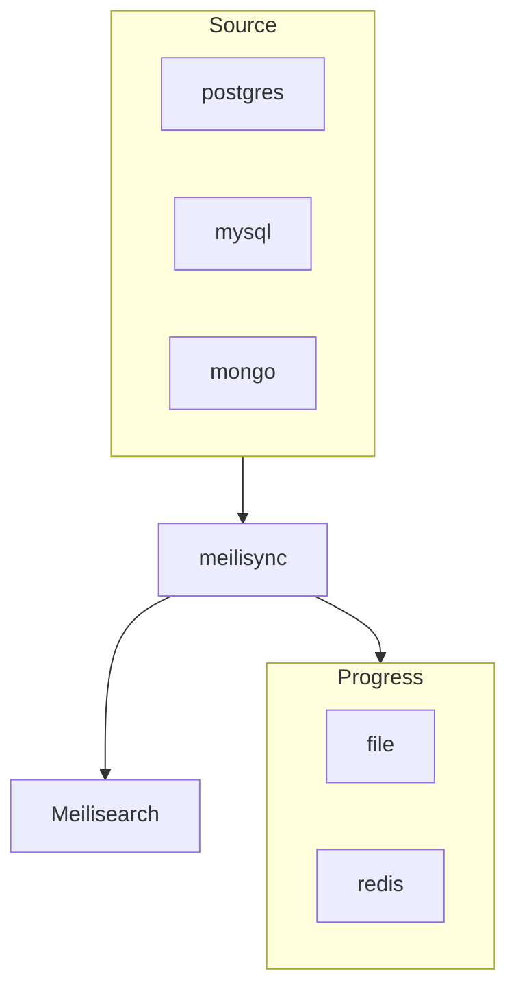

# Sources

meilisync supports one source process per config file. Run several containers if you need several databases.

| `source.type` | Transport | Extra |
| --- | --- | --- |
| `postgres` | Logical replication, `wal2json` | `postgres` (also in the base install) |
| `mysql` | Binary log (`ROW`) | `mysql` |
| `mongo` | Change stream (replica set) | `mongodb` |

Pick a source:

- [PostgreSQL](postgres.md) — recommended, and the focus of this fork
- [MySQL](mysql.md)
- [MongoDB](mongodb.md)
